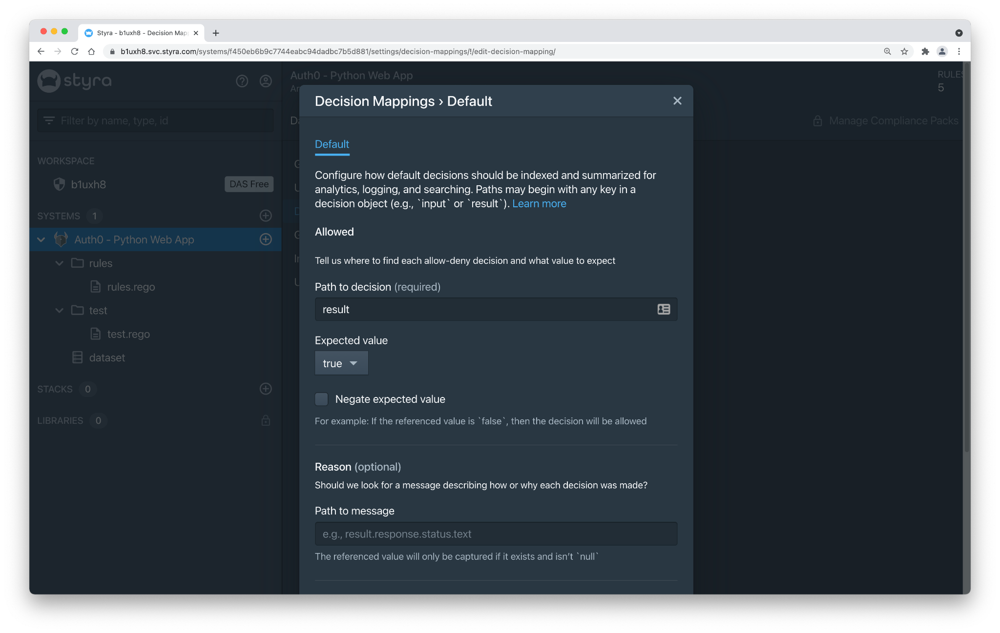
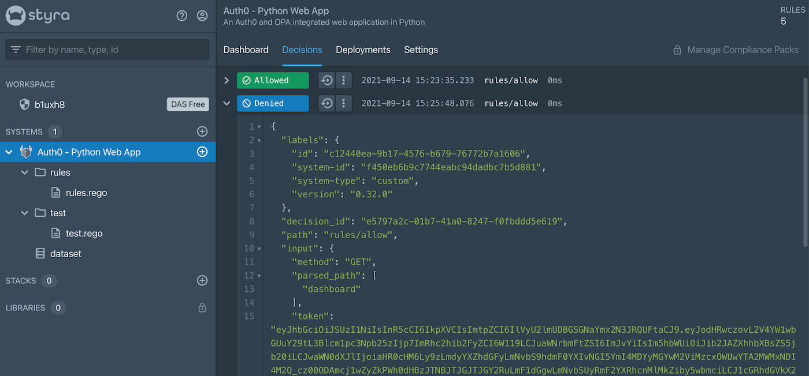

# Styra DAS with OPA and Auth0 Python Web App Sample

In this guide we will utilize [Open Policy Agent](https://www.openpolicyagent.org) (OPA) for external, decoupled policy for application authorization with an example Auth0 web app. The [Styra Declarative Authorization Service](https://www.styra.com) (DAS) will be leveraged for authoring declarative policy in [Rego](https://www.openpolicyagent.org/docs/latest/policy-language/) and distribution to OPA, along with centralized decision logging and auditing.

## Prerequisites

Before you get started, you'll need:

-   An Auth0 account. You can [sign up for free](https://auth0.com/signup).
-   An Styra DAS account. You can [sign up for free](https://signup.styra.com).
-   A local development environment with tools including [Python](https://www.python.org/downloads/) for the example application and [Open Policy Agent](https://www.openpolicyagent.org/docs/latest/#running-opa) for integration with the Python app for fine-grained, decoupled, authorization.

## Configure Auth0

### Create a new Application

1. Go to [Auth0 Dashboard > Applications > Applications](https://manage.auth0.com/#/applications).
2. Select **Create Application**.
3. Add a meaningful name like "Styra DAS - Python Web App".
4. Select **Regular Web Application**, then **Create**.
5. Select "Python"
6. Select **Download Sample**, then **Download**
7. Select the **Settings** tab
8. Add `http://localhost:3000/callback` to the **Allowed Callback URLs** field.
9. Add  `http://localhost:3000` to the **Allowed Logout URLs** field.

### Create test Users

In the following steps you will create two test users, "alice" and "bob" and add to each user unique attribute metadata. Later on in this guide the metadata will be used by the OPA policy implementation in order to make fine-grained authorization decisions for your application.

1. Go to [Auth0 Dashboard > User Management > Users](https://manage.auth0.com/#/users).
2. Select **Create User**.
3. Enter an **Email** and **Password**.
  1. User 1: "alice@example.com"
  2. User 2: "bob@example.com"
5. Select the Database Connection that is active for the Application created above.
6. Select **Create**.
7. Scroll to **Metadata** > **app_metadata** and add additional information that will ultimately appear in the issued ID token.
  1. User 1 - alice

```json
{
	"styra": {
		"permissions": {
			"dashboard": ["view"]
		}
	}
}
```

  2. User 2 - bob

```json
{
	"styra": {
		"permissions": {
			"dashboard": []
		}
	}
}
```

Within the above `app_metadata`, we have created a `styra.permissions` object with a JSON key-value pair. The key is `dashboard`, which represents the dashboard page within the Python application. The value is an array of permissions that could be relevant to actions for the page. In this example, only the `view` action is applicable for the Dashboard page. Alice is granted the view permission for the dashboard, while Bob is not granted any permissions (i.e. an empty array).

In the next step below, we will create an [Auth0 Action](https://auth0.com/docs/actions) that will add the `app_metadata` to the ID token issued for the logged in user.  There are a number of other approaches that can be used to enrich a token with [custom claims](https://auth0.com/docs/configure/apis/scopes/sample-use-cases-scopes-and-claims#add-custom-claims-to-a-token) in Auth0 - populating [metadata](https://auth0.com/docs/users/metadata) is but one example.  

Additionally, there are a variety of mechanisms to provide fine-grained attribute data to Open Policy Agent so that OPA can make context-aware authorization decisions. Providing data to OPA in a JWT token is one of five common approaches to working with [external data](https://www.openpolicyagent.org/docs/latest/external-data/) with OPA.

### Populate the ID Token via an Action

Let's create a Styra Action to automatically add properties from `app_metadata` to the ID token alongside the standard OIDC claims - name, email, etc. - so it can be consumed by the OPA policy for authorization decisions.

1. Go to [Auth0 Dashboard > Actions > Library](https://manage.auth0.com/#/actions/library).
2. Select **Build Custom**.
	1. Name: "Styra Action"
	2. Trigger: "Login / Post Login"
	3. Runtime: Node 16
3. Select **Create**.
4. Replace the Action code with

```js
exports.onExecutePostLogin = async (event, api) => {
  const { permissions } = event.user.app_metadata.styra || {};
  if (permissions) {
    api.idToken.setCustomClaim('https://styra/permissions', permissions);
  }
}
```

5. Select **Deploy**.
6. Add the "Styra Action" to the **Login** Flow by dragging the action and dropping between the "Start" (User Logged In) and "Complete" (Token Issued) states.
7. Select **Apply**.

### Run the Application

Run `pip install -r requirements.txt` to install the dependencies and run `python server.py`. The app will be served at [http://localhost:3000/](http://localhost:3000/).

### View the Dashboard

Login to the application with alice and bob respectively. Confirm that the application Dashboard page is functioning and fully viewable by each user. The Dashboard will display the contents of the logged in user's ID token, including the `https://styra/permissions` custom claim that was added via the Auth0 action.

At this point, we have a functioning application that requires Auth0 *authentication* in order to view the Dashboard page, but it does not yet require *authorization*. Let's implement an authorization policy with OPA and Styra DAS!

## Configure Styra DAS

### Create a new System

1. Go to your Styra DAS Free tenant and Create a System **(+)**
2. Select **Custom** System type
3. Add a meaningful name like "Auth0 - Python Web App".
4. Select **Add System**.


### Configure OPA for Styra

1. If not already installed, then [download OPA](https://www.openpolicyagent.org/docs/latest/#1-download-opa) to your local environment
2. Download the Styra configuration for OPA per the provided instructions on the Install page. This will create a file named `opa-conf.yaml` in a local directory
3. Run OPA with Styra configuration

```bash
> opa run --server --config-file=opa-conf.yaml
```

OPA will start in server mode, listening on localhost port 8181 by default. Within a few moments the OPA will connect to Styra DAS, and the DAS UI will show the Status of the OPA instance on the Deployments tab.


### Update the Policy Rego

Copy and paste the policy code below into `rules.rego` file. For reference this file is also available in the example app git repository here: [rules.rego](https://github.com/StyraInc/das-opa-samples/blob/main/auth0/python-web-app/rules/rules.rego)


```
package rules

import data.dataset

# deny access by default
default allow = false

# allow access if the token is valid AND the action is allowed
allow {
	is_token_valid
	action_allowed
}

# allow a GET to /dashboard if dashboard permissions include "view"
action_allowed {
	input.method == "GET"
	input.parsed_path = ["dashboard"]
	permissions := token.payload["https://styra/permissions"]
	permissions.dashboard[_] == "view"
}

# ensure the token signature is valid, and the token has not expired
is_token_valid {
	token.valid
	now := time.now_ns() / 1000000000
	now < token.payload.exp
}

# verify the JWT using the JWKS data, and decode the payload
token := {"valid": valid, "payload": payload} {
	jwt := input.token
	jwks := json.marshal(dataset)
	valid := io.jwt.verify_rs256(jwt, jwks)
	[_, payload, _] := io.jwt.decode(jwt)
}
```

Select **Publish**, then **Publish changes**.

Within a few moments after publishing, the updated policy will be loaded into the running OPA in your local development environment. However, the policy relies on additional data which we will load into OPA next.

### Update the Policy Data

The [Auth0 JSON Web Key Sets](https://auth0.com/docs/security/tokens/json-web-tokens/json-web-key-sets) data is needed in order for the Rego policy to verify the signature of the JWT ID token. You can retrieve the keys for your domain from the JWKS URI endpoint:

```
https://YOUR_AUTH0_DOMAIN/.well-known/jwks.json
```

Copy the contents of `jwks.json` and paste into the dataset within your Styra DAS system. (Replace any existing content in the dataset.)

Select **Publish**, then **Publish changes**.


**Note:** There are many ways to integrate datasets into Styra DAS. For simplicity in this guide we manually copied the data into the dataset, however a number of automated approaches inclusive of both push and pull mechanisms can be configured in DAS. In a proper implementation we would utilize either a dynamic pull or push approach to automatically update the JWKS data when keys are rotated.  For additional detail on these approaches see [Styra DAS Data Sources](https://docs.styra.com/v1/docs/policy-authoring/datasources/overview/).

### Update the Decision Mappings

[Decision Mappings](https://docs.styra.com/v1/docs/use-cases/custom/decision-mapping/) in a Styra DAS Custom system type are needed to inform DAS how to interpret the OPA decision log result. In the case of our policy, the decision result will contain a simple boolean true or false value.

1. Go to System > Settings > Decision Mappings > Default
2. Set **Path to decision** to `result`, then **Update mapping**



## Configure the Python Web App

Add the following 2 lines to the .env file in the Python web application directory. For reference this file is also available in the example app git repository here: [.env](https://github.com/StyraInc/das-opa-samples/commit/b56a146ac0c50a361b2b70abf9f5cdd2618f61a9)

```
OPA_ADDR=http://localhost:8181
OPA_POLICY_PATH=/v1/data/rules/allow
```

Within the `server.py` file there are a few minor changes needed in order to have the Python app call out to OPA for authorization. The primary change introduces a new decorator method `requires_opa_authz` that will query OPA for an authorization decision and enforce the result: either allow the request processing to continue or return a 403 Forbidden error.

The code snippet below is not the only change needed within `server.py`. To implement the full set of of changes required, copy the contents of server.py from the example app git repository into your local development environment: [server.py](https://github.com/StyraInc/das-opa-samples/commit/a6f8e63572a0c5d939a110979e11347064c34afd#diff-c3f638308bb8e78f5ba9409a5b394b462a8ef7a2e8c356bedf5bec31bba4accc)

```python
def requires_opa_authz(f):
   @wraps(f)
   def decorated(*args, **kwargs):
       input = {
           "method": request.method,
           "parsed_path": request.path.split("/")[1:],
           "token": session['id_token']
       }
       try:
           response = requests.post(OPA_ADDR + OPA_POLICY_PATH, data=json.dumps({"input": input}))
           response.raise_for_status()
       except:
           return "Forbidden", 403
       return f(*args, **kwargs)
   return decorated
```

## Try It Out

### Access the Dashboard

Let's test out the application with the new version of the Python app integrated with OPA for decoupled authorization.

1. Log into the application at `http://localhost:3000` as the "alice@example.com" user.
2. Confirm that Alice can view the Dashboard.


3. Log into the application as the "bob@example.com" user.
4. Confirm that Bob cannot view the Dashboard (a "Forbidden" response).

### Audit the Decisions 

1. In Styra DAS go to System > Decisions
2. View the **Allowed** decision for the Alice request
3. View the **Denied** decision for the Bob request



We have successfully integrated the Python application with OPA for authorization, while using DAS for policy lifecycle management!

## Authors

[Auth0](https://auth0.com)

[Styra](https://styra.com)

## License

This project is licensed under the MIT license. See the [LICENSE](LICENCE) file for more info.
